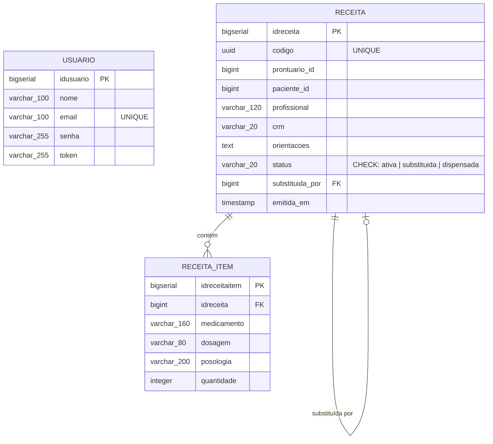

# Diagrama ER — G6 Receitas Médicas

## Relacionamentos

| De | Para | Cardinalidade | Descrição |
|---|---|---|---|
| RECEITA | RECEITA_ITEM | 1:N | Uma receita contém um ou mais medicamentos |
| RECEITA | RECEITA | 0..1:1 | Auto-relacionamento: substituida_por aponta para outra receita |

## Constraints

| Tabela | Constraint | Tipo | Detalhe |
|---|---|---|---|
| usuario | pk_usuario | PRIMARY KEY | idusuario |
| usuario | uq_email | UNIQUE | email |
| receita | pk_receita | PRIMARY KEY | idreceita |
| receita | uq_codigo | UNIQUE | codigo (UUID) |
| receita | fk_receita_substituta | FOREIGN KEY | substituida_por → receita.idreceita |
| receita | ck_status | CHECK | status IN ('ativa', 'substituida', 'dispensada') |
| receita_item | pk_receita_item | PRIMARY KEY | idreceitaitem |
| receita_item | fk_item_receita | FOREIGN KEY | idreceita → receita.idreceita |

## Objetos adicionais do banco

| Objeto | Nome | Descrição |
|---|---|---|
| View | vw_receitas_ativas | Receitas ativas com contagem de medicamentos |
| Stored Procedure | sp_substituir_receita | Substitui receita de forma atômica |
| Trigger | trg_impedir_edicao_receita | Bloqueia edição de campos clínicos após emissão |
